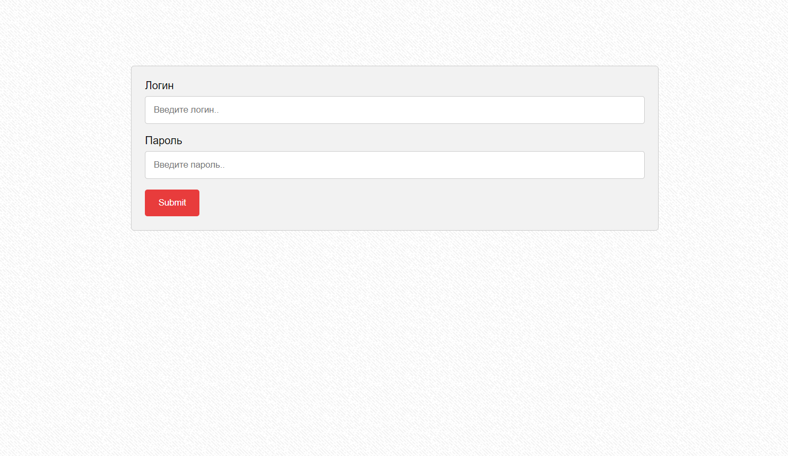
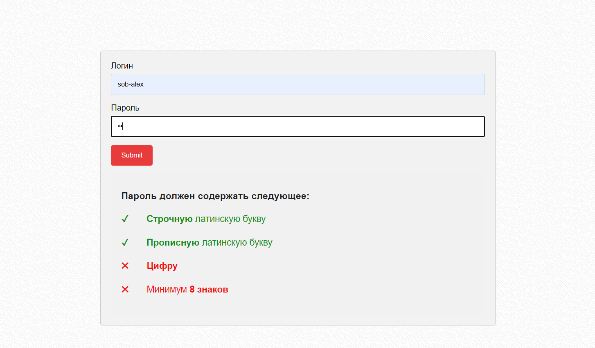
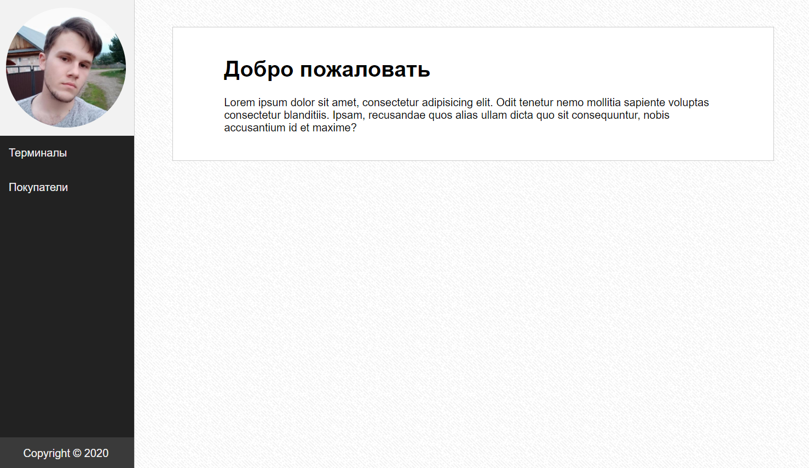
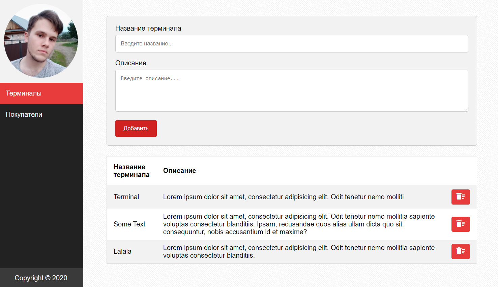
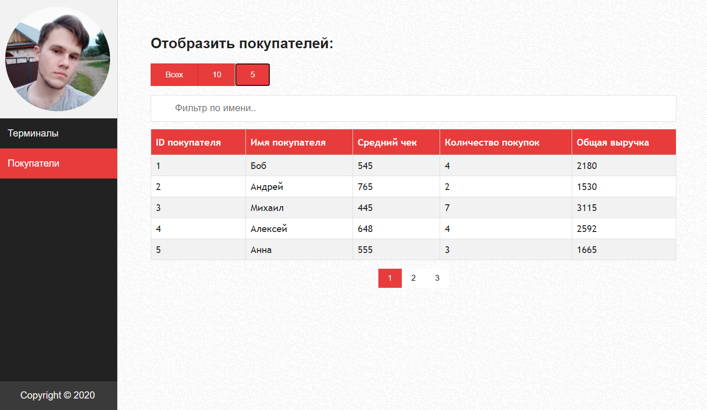
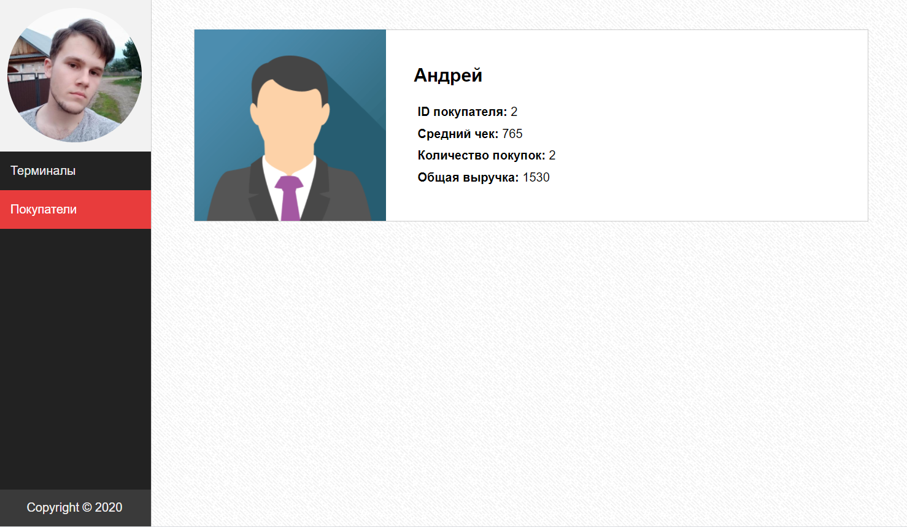

This project was bootstrapped with [Create React App](https://github.com/facebook/create-react-app).

## Task
1.  Инициировать проект на React (можно использовать Create React App) 
2.  Сделать страницу авторизации, на которой запрашивается Логин и Пароль
3.  При вводе логина и пароля: 
  - по логину запросить аватар пользователя с Github 
  - пароль проверить на то, чтобы было не менее 8 символов, хотя бы 1 
прописная латинская буква, хотя бы 1 прописная латинская буква, хотя бы 1 
цифра. 
Пропускать далее, только если имеется такой пользователь на Github и пароль прошел проверку. 
4.  Реализовать адаптивный сайдбар в виде отдельного компонента, 
который не должен перерисовываться с переходом по страницам: 
Сверху аватар пользователя, полученный с Github 
По центру 2 ссылки Терминалы и Покупатели 
В футере сайдбара Copyright © 2020 
5.  Реализовать 3 маршрута: 
/terminals 
/buyers 
/buyers/id 
6.  Страница Терминалы 
Необходимо сделать поля ввода «Название терминала», «Описание» и 
кнопку «Добавить» 
После ввода названия, Терминал должен отобразиться ниже в таблице 
Список терминалов с кнопкой «Удалить» 
7.  Страница Покупатели 
Отобразить таблицу «Покупатели» со столбцами: 
- ID покупателя
- Имя покупателя
- Средний чек
- Количество покупок
- Общая выручка

Заполнить из массива 15-ю любыми значениями (минимум 2-3 одинаковых 
имени для фильтра). 
В таблице должна быть сортировка по столбцам Средний чек, Количество 
Покупок и Общая выручка, фильтр по столбцу Имя. 
Возможность отобразить по 5, 10 или 15 покупателей. Если выбран режим 5, 
то должна быть пагинация  
ID покупателя должен быть кликабельным с переходом на маршрут /buyers/id  
8.  Страница Покупатель 
Необходимо отобразить данные из таблицы по покупателю с таким ID  
9.  Страница 404 
На остальных маршрутах сделать страницу-заглушку с ошибкой 404  
10.  Страницы оформить по своему усмотрению.  
Рекомендуется использовать функциональные компоненты и React-хуки. Результаты выложить на Github.

## Screenshots

  

## Available Scripts

In the project directory, you can run:

### `yarn start`

Runs the app in the development mode. 
Open [http://localhost:3000](http://localhost:3000) to view it in the browser.

The page will reload if you make edits. 
You will also see any lint errors in the console.

### `yarn test`

Launches the test runner in the interactive watch mode. 
See the section about [running tests](https://facebook.github.io/create-react-app/docs/running-tests) for more information.

### `yarn build`

Builds the app for production to the `build` folder. 
It correctly bundles React in production mode and optimizes the build for the best performance.

The build is minified and the filenames include the hashes. 
Your app is ready to be deployed!

See the section about [deployment](https://facebook.github.io/create-react-app/docs/deployment) for more information.

### `yarn eject`

**Note: this is a one-way operation. Once you `eject`, you can’t go back!**

If you aren’t satisfied with the build tool and configuration choices, you can `eject` at any time. This command will remove the single build dependency from your project.

Instead, it will copy all the configuration files and the transitive dependencies (webpack, Babel, ESLint, etc) right into your project so you have full control over them. All of the commands except `eject` will still work, but they will point to the copied scripts so you can tweak them. At this point you’re on your own.

You don’t have to ever use `eject`. The curated feature set is suitable for small and middle deployments, and you shouldn’t feel obligated to use this feature. However we understand that this tool wouldn’t be useful if you couldn’t customize it when you are ready for it.

## Learn More

You can learn more in the [Create React App documentation](https://facebook.github.io/create-react-app/docs/getting-started).

To learn React, check out the [React documentation](https://reactjs.org/).

### Code Splitting

This section has moved here: https://facebook.github.io/create-react-app/docs/code-splitting

### Analyzing the Bundle Size

This section has moved here: https://facebook.github.io/create-react-app/docs/analyzing-the-bundle-size

### Making a Progressive Web App

This section has moved here: https://facebook.github.io/create-react-app/docs/making-a-progressive-web-app

### Advanced Configuration

This section has moved here: https://facebook.github.io/create-react-app/docs/advanced-configuration

### Deployment

This section has moved here: https://facebook.github.io/create-react-app/docs/deployment

### `yarn build` fails to minify

This section has moved here: https://facebook.github.io/create-react-app/docs/troubleshooting#npm-run-build-fails-to-minify
